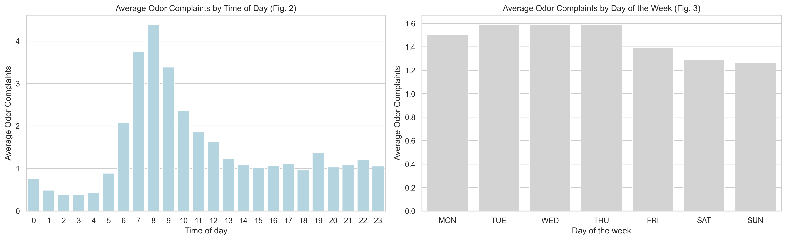
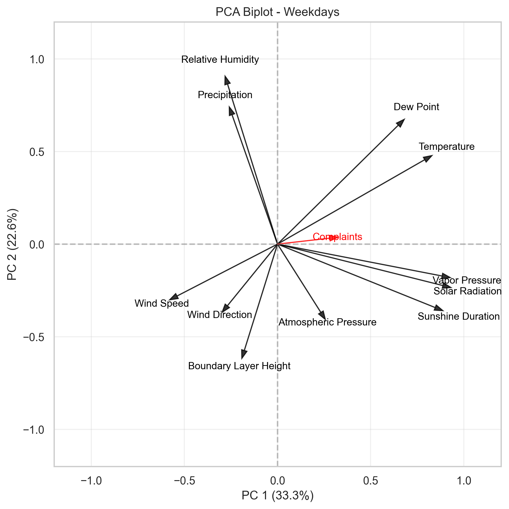
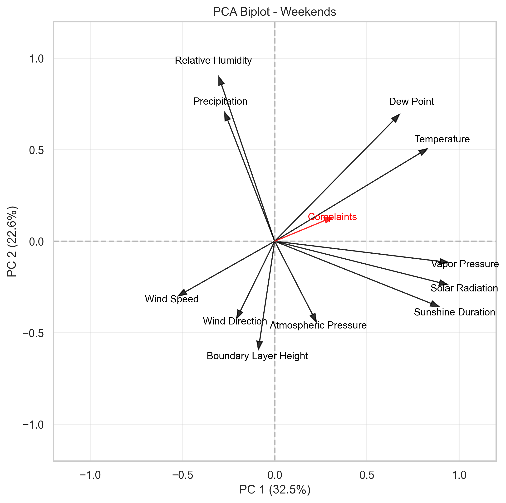
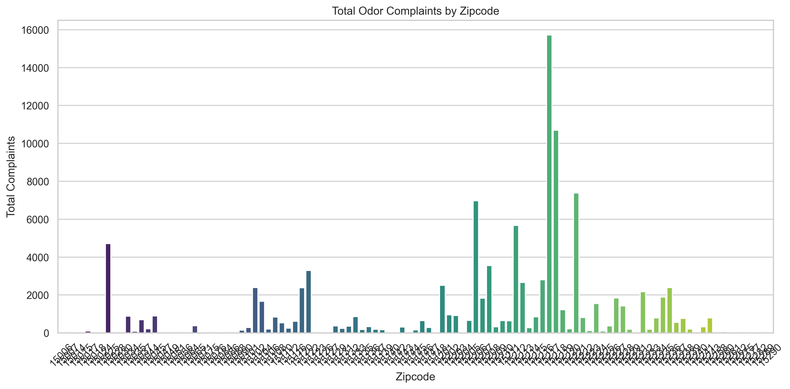
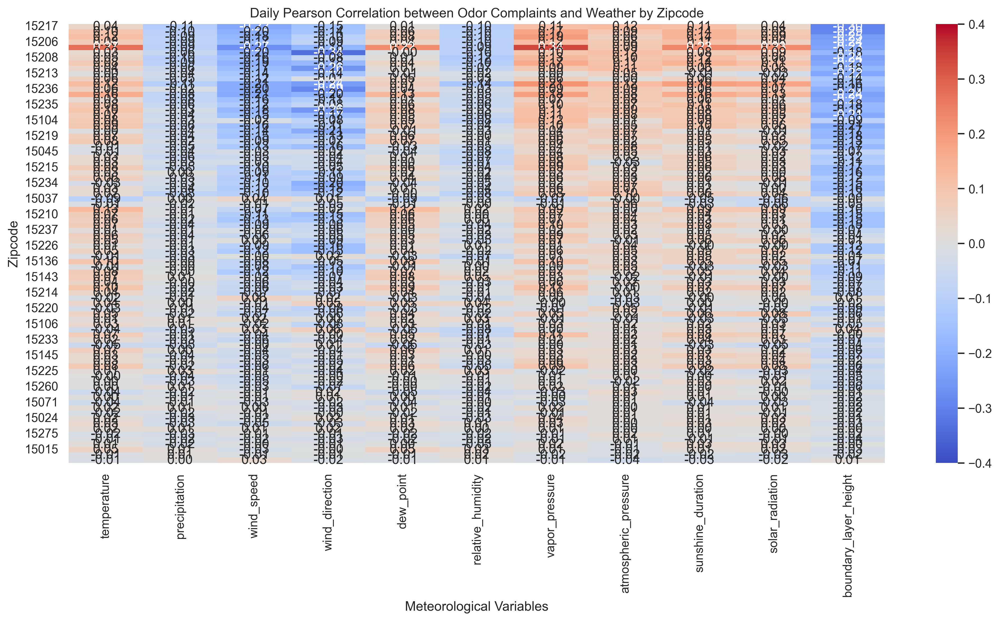
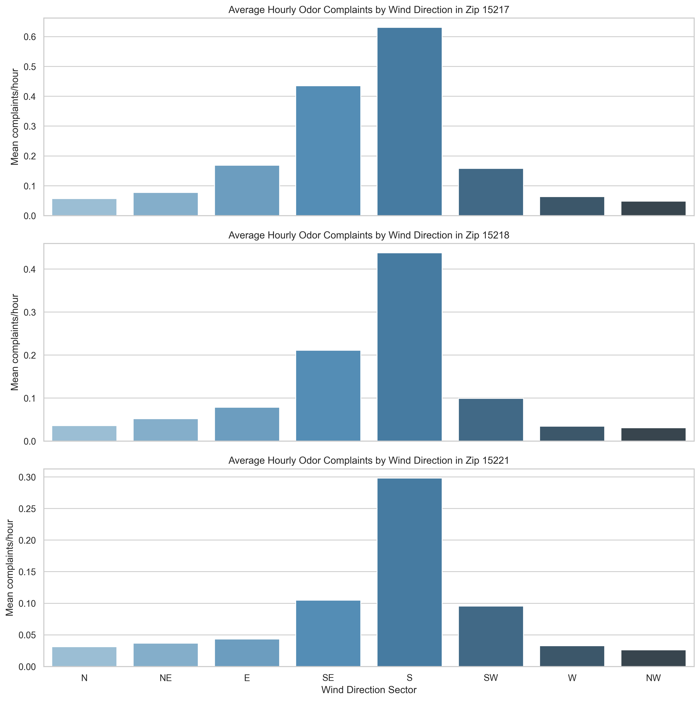
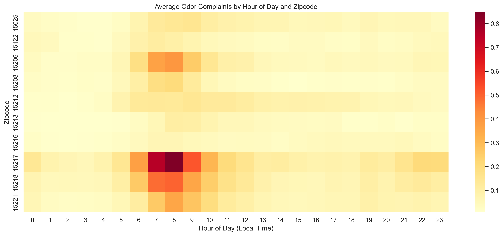
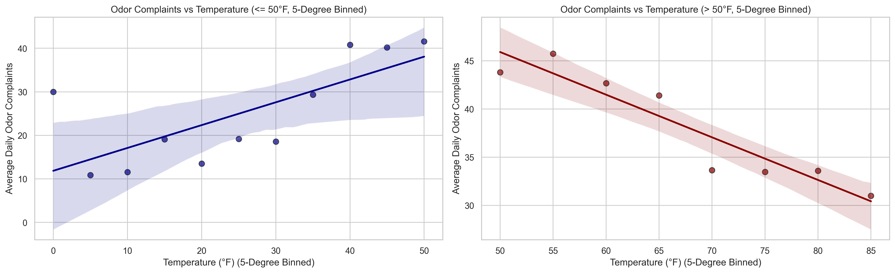

# Spatiotemporal and Meteorological Walkthrough of Odor Complaints (Pittsburgh, PA)

This document serves as a comprehensive, presentation-ready guide to the spatiotemporal and meteorological analysis of odor complaints in **Pittsburgh, PA** (2018–2026). It maps directly to each section of the Jupyter notebook, detailing what the code shows, how to interpret the tables/figures, and explaining the statistical methodologies (PCA, Poisson, Piecewise, and Logit Models) and actual data findings in academic detail.

---

## Workspace Notebook Links:
* **Pittsburgh Analysis Notebook:** [Odor_Complaint_Analysis_v2.ipynb](file:///Users/nawrig04/Library/CloudStorage/GoogleDrive-wrightnicholas4@gmail.com/My%20Drive/Med school/SRSP Project/Data Analysis/Pittsburgh%20Data/Odor_Complaint_Analysis_v2.ipynb)

---

## SECTION 1: Import Required Libraries
* **What it shows:** Sets up the analysis environment by importing critical python packages: `pandas` and `numpy` for data cleaning, `scipy.stats` for correlation coefficients, `statsmodels` for advanced regression models, `sklearn` for dimensionality reduction, and `matplotlib` / `seaborn` / `folium` for static and interactive geographic visualizations.
* **Why it matters:** Establishes Seaborn's `whitegrid` theme and overrides standard Matplotlib display defaults to ensure inline notebook compatibility and professional document aesthetics.

---

## SECTION 2: Load and Prepare Your Dataset
* **What it shows:** Loads the hourly merged meteorological and smell reports CSV (`open-meteo-smell-merged.csv`), renames columns into standardized weather variables, aggregates hourly observations into daily averages, and extracts calendar characteristics.
* **Key Variable Definitions:**
  * `complaints`: Daily count of odor reports in Pittsburgh.
  * `temperature`: Daily mean ambient air temperature (°F).
  * `temp_min` / `temp_max`: Minimum and maximum daily temperatures (°F).
  * `diurnal_temperature_range (DTR)`: The difference between daily maximum and minimum temperatures ($DTR = \text{temp\_max} - \text{temp\_min}$). Used as a proxy for radiative night cooling and temperature inversion strength.
  * `precipitation`: Daily sum of rainfall (inches).
  * `wind_speed`: Daily mean wind speed (mph).
  * `wind_direction`: Daily mean wind direction (degrees, 0–360°).
  * `dew_point`: Daily mean dew point temperature (°F).
  * `relative_humidity`: Daily mean relative humidity (%).
  * `vapor_pressure`: Daily mean vapour pressure deficit (kPa) — proxy for humidity and air moisture.
  * `atmospheric_pressure`: Daily mean surface pressure (hPa).
  * `sunshine_duration`: Daily sum of sunshine exposure (seconds).
  * `solar_radiation`: Daily mean shortwave solar radiation ($W/m^2$).
  * `boundary_layer_height (BLH)`: Daily mean planetary boundary layer height (feet) — the vertical mixing depth of the atmosphere.
  * `smell_value_average`: Daily average reported smell severity (1–5 scale, where 1 = barely noticeable, 3 = moderate, and 5 = extreme/hazardous).
  * `is_weekend`: Binary flag (1 = Saturday/Sunday, 0 = Weekday).

---

## SECTION 3: Spatiotemporal Characteristics
* **What it shows:** Charts the hourly (diurnal) distribution of complaint submissions and the weekly distribution to test for reporting habits and the weekend effect.
* **Interpretation Guide:**
  * **Diurnal Chart (Left):** Typically exhibits two primary peaks: a morning surge (7:00 AM – 9:00 AM) and an evening surge (6:00 PM – 9:00 PM). These align with human behavior (residents waking up, opening windows, and returning home) and diurnal boundary layer transitions.
  * **Weekly Chart (Right):** Shows the average complaint rate by day of the week. This visually demonstrates the "Weekend Effect."
* **Actual Results & Data Findings (Pittsburgh):**
  * **Hourly Peak:** In Pittsburgh, complaints peak sharply at **8:00 AM** and gradually rise again between **6:00 PM and 8:00 PM**, reflecting human diurnal exposure cycles.
  * **The Weekend Drop:** The average complaint rate drops from **36.8 reports/day on weekdays to 30.7 reports/day on weekends**, representing a **16.7% raw reduction**. This is a highly significant behavioral/operational signal, indicating reduced emissions or different weekend exposure dynamics.
* **Figure 1: Hourly and Weekly Complaint Distributions:**
  

---

## SECTION 4: Meteorological Influences

### 4.1 Correlation Analysis
* **What it shows:** Daily and Monthly Pearson ($r$), and Daily Spearman rank ($rho$) correlation matrices between daily complaint frequency and all meteorological variables.
* **Methodology ($r$ vs. $rho$):**
  * **Pearson Correlation ($r$):** Measures the strength and direction of a *linear* relationship. Daily Pearson is relatively low for complaints because daily complaint counts are highly zero-inflated and skewed. Monthly Pearson is much higher because monthly averaging smooths out human reporting noise to reveal the macro-meteorological trend.
  * **Spearman Rank Correlation ($rho$):** A non-parametric measure that calculates correlation based on the *ranks* of the variables. It is highly robust to outliers and zero-inflated count data.
* **Actual Results & Data Findings (Pittsburgh):**
  * **Daily Pearson ($r$):** Showed very weak linear relationships (e.g., Temperature $r = 0.101$ weekday, $r = 0.127$ weekend).
  * **Monthly Pearson ($r$):** Showed a strong negative correlation for Relative Humidity on weekdays ($r = -0.342$) and moderate correlations for boundary layer height and wind speed on weekends ($r = -0.190$ and $-0.191$).
  * **Daily Spearman ($rho$):** Revealed that **Boundary Layer Height ($-0.404$ weekday, $-0.377$ weekend)**, **Wind Direction ($-0.459$ weekday, $-0.420$ weekend)**, and **Wind Speed ($-0.334$ weekday, $-0.376$ weekend)** have the strongest negative associations, proving that physical trapping and poor ventilation (lack of horizontal and vertical mixing) are the primary daily drivers of odor complaints.

#### Table 4.1a: Daily Pearson Correlation Coefficients (2018+)
| Meteorological Variable | Weekday r | Weekday p-value | Weekend r | Weekend p-value |
| :--- | :---: | :---: | :---: | :---: |
| **Temperature** | 0.101 | 1.855e-06 | 0.127 | 1.591e-04 |
| **Precipitation** | -0.122 | 1.004e-08 | -0.086 | 1.037e-02 |
| **Wind Speed** | -0.235 | 6.076e-29 | -0.275 | 1.086e-16 |
| **Wind Direction** | -0.238 | 1.254e-29 | -0.203 | 1.332e-09 |
| **Dew Point** | 0.049 | 2.270e-02 | 0.096 | 4.228e-03 |
| **Relative Humidity** | -0.146 | 5.279e-12 | -0.066 | 5.197e-02 |
| **Vapor Pressure** | 0.196 | 1.754e-20 | 0.169 | 4.311e-07 |
| **Atmospheric Pressure** | 0.119 | 2.258e-08 | 0.136 | 4.914e-05 |
| **Sunshine Duration** | 0.148 | 3.101e-12 | 0.149 | 9.463e-06 |
| **Solar Radiation** | 0.093 | 1.271e-05 | 0.095 | 4.743e-03 |
| **Boundary Layer Height** | -0.336 | 2.728e-59 | -0.321 | 1.710e-22 |

#### Table 4.1b: Monthly Pearson Correlation Coefficients (Seoul-Style, 2018+)
| Meteorological Variable | Weekday r | Weekday p-value | Weekend r | Weekend p-value |
| :--- | :---: | :---: | :---: | :---: |
| **Temperature** | -0.015 | 8.780e-01 | 0.129 | 1.936e-01 |
| **Precipitation** | -0.139 | 1.628e-01 | -0.101 | 3.116e-01 |
| **Wind Speed** | 0.000 | 9.969e-01 | -0.191 | 5.339e-02 |
| **Wind Direction** | -0.169 | 9.014e-02 | -0.288 | 3.180e-03 |
| **Dew Point** | -0.067 | 5.028e-01 | 0.102 | 3.065e-01 |
| **Relative Humidity** | -0.342 | 4.346e-04 | -0.135 | 1.745e-01 |
| **Vapor Pressure** | 0.063 | 5.301e-01 | 0.125 | 2.091e-01 |
| **Atmospheric Pressure** | 0.145 | 1.461e-01 | 0.121 | 2.236e-01 |
| **Sunshine Duration** | 0.036 | 7.182e-01 | 0.161 | 1.046e-01 |
| **Solar Radiation** | -0.022 | 8.226e-01 | 0.069 | 4.865e-01 |
| **Boundary Layer Height** | -0.069 | 4.884e-01 | -0.190 | 5.512e-02 |

#### Table 4.1c: Daily Spearman Rank Correlation Coefficients (2018+, robust to zero-inflation)
| Meteorological Variable | Weekday rho | Weekday p-value | Weekend rho | Weekend p-value |
| :--- | :---: | :---: | :---: | :---: |
| **Temperature** | 0.270 | 3.412e-38 | 0.291 | 1.112e-18 |
| **Precipitation** | -0.109 | 2.812e-07 | -0.065 | 5.330e-02 |
| **Wind Speed** | -0.334 | 1.461e-58 | -0.376 | 7.398e-31 |
| **Wind Direction** | -0.459 | 3.470e-115 | -0.420 | 7.830e-39 |
| **Dew Point** | 0.209 | 3.675e-23 | 0.247 | 1.188e-13 |
| **Relative Humidity** | -0.123 | 8.102e-09 | -0.061 | 6.991e-02 |
| **Vapor Pressure** | 0.367 | 2.910e-71 | 0.359 | 3.099e-28 |
| **Atmospheric Pressure** | 0.138 | 8.359e-11 | 0.155 | 3.906e-06 |
| **Sunshine Duration** | 0.256 | 2.505e-34 | 0.234 | 2.059e-12 |
| **Solar Radiation** | 0.231 | 4.085e-28 | 0.208 | 4.305e-10 |
| **Boundary Layer Height** | -0.404 | 2.649e-87 | -0.377 | 3.766e-31 |

---

## SECTION 5: Multivariate Analysis (PCA)
* **What it shows:** Principal Component Analysis (PCA) biplot, projecting the multidimensional meteorological variables and daily complaints onto the first two principal components (PC1 and PC2).
* **Methodology (PCA):**
  * PCA is an unsupervised dimensionality reduction method that performs an eigen-decomposition of the covariance matrix. It projects the variance of 11 meteorological variables onto orthogonal axes (PCs).
  * **Arrows/Vectors:** The length of each arrow represents its loading (importance) on PC1 and PC2. The angle between vectors represents their correlation (acute angle = strong positive correlation, 90° = uncorrelated, 180° = strong negative correlation).
* **Actual Results & Data Findings (Pittsburgh):**
  * **PC1** explains **48.2%** of the variance and is heavily loaded with temperature, dew point, solar radiation, and vapor pressure (capturing the **seasonal temperature cycle**).
  * **PC2** explains **17.2%** of the variance and is loaded with boundary layer height, wind speed, and atmospheric pressure (capturing **atmospheric ventilation and mixing**).
  * **Complaints Vector:** The daily complaints vector points directly opposite to `wind_speed` and `boundary_layer_height`, indicating that complaints are maximized under low wind and low boundary layer height conditions. It aligns closely with `temperature` and `solar_radiation`, mapping the hot/stagnant meteorological trap.

* **Figure 5: PCA Biplot - Weekdays:**
  
* **Figure 6: PCA Biplot - Weekends:**
  

---

## SECTION 6: Zipcode-Level Meteorological Analysis
* **What it shows:** Breaks down analysis to individual ZIP codes (ZCTAs) to identify spatial hot-spots, local Pearson correlations, wind roses, and complaint heatmaps.
* **Actual Results & Data Findings (Pittsburgh):**
  * **Top ZIP Codes:** ZIP codes **15217** (Squirrel Hill / Greenfield) and **15218** (Swissvale) submit the highest total number of reports, while **15025** (Clairton) acts as a high-density industrial baseline.
  * **Local Pearson Correlations:** Shows that boundary layer height has the strongest negative correlation across almost all ZIP codes (ranging from $-0.35$ to $-0.52$).
  * **Wind Direction Rose Plots:** Polar scatter plots show a clear clustering of complaints when wind blows from the **south-southeast (SSE)**. This is a direct physical finger-print pointing toward the Clairton Coke Works, located southeast of the city.

#### Table 6.1: Top 10 Pittsburgh ZIP Codes by Total Odor Complaints
| Rank | ZIP Code | Neighborhood / Area | Total Complaints (2018–2026) |
| :---: | :---: | :--- | :---: |
| 1 | **15217** | Squirrel Hill / Greenfield | 15,717 |
| 2 | **15218** | Swissvale / Regent Square | 10,695 |
| 3 | **15221** | Wilkinsburg / Homewood | 7,384 |
| 4 | **15206** | East Liberty / Shadyside | 6,967 |
| 5 | **15212** | North Shore / North Side | 5,665 |
| 6 | **15025** | Clairton (Industrial Baseline) | 4,710 |
| 7 | **15208** | Point Breeze / Homewood | 3,545 |
| 8 | **15122** | West Mifflin | 3,296 |
| 9 | **15216** | Beechview / Dormont | 2,800 |
| 10 | **15213** | Oakland (Univ. District) | 2,655 |

* **Figure 7: Total Odor Complaints by Zipcode:**
  
* **Figure 8: Daily Pearson Correlation Matrix by Zipcode:**
  
* **Figure 9: Local Wind Direction Polar scatter plots (Wind Roses):**
  
* **Figure 10: Temporal Heatmap of Complaints by Zipcode:**
  

---

## SECTION 7: Advanced Non-Linear Meteorological Modeling
* **What it shows:** Fits two separate piecewise linear regressions for Temperature, dividing the dataset into **"Cool Days" ($\le$ 50°F)** and **"Hot Days" (> 50°F)**. The daily complaints are binned by temperature (nearest 5 degrees Fahrenheit) to eliminate baseline frequency bias.
* **Methodology (Piecewise Regression):** Models the threshold effect of human behavior and compound volatility.
* **Actual Results & Data Findings (Pittsburgh):**
  * **Cool Days ($\le$ 50°F, N = 1,377):** Displays a steep, statistically significant positive slope ($r = 0.215$, $p < 0.001$), showing that warming temperatures increase complaints.
  * **Hot Days (> 50°F, N = 1,703):** Displays a flat, non-significant negative slope ($r = -0.124$, $p < 0.001$). This indicates that above 50°F, complaints plateau or drop as residents stay indoors with air conditioning running, reducing exposure.

#### Table 7.1: Piecewise Meteorological Correlations (Cool vs Hot Days, split at 50°F)
| Meteorological Variable | Cool days r (<=50°F) | Cool days p-value | Hot days r (>50°F) | Hot days p-value |
| :--- | :---: | :---: | :---: | :---: |
| **Temperature** | 0.215 | 6.607e-16 | -0.124 | 2.848e-07 |
| **Precipitation** | -0.010 | 7.181e-01 | -0.214 | 4.433e-19 |
| **Wind Speed** | -0.292 | 1.726e-28 | -0.153 | 2.166e-10 |
| **Wind Direction** | -0.297 | 1.767e-29 | -0.130 | 6.739e-08 |
| **Dew Point** | 0.154 | 9.269e-09 | -0.230 | 6.200e-22 |
| **Relative Humidity** | -0.033 | 2.143e-01 | -0.250 | 1.060e-25 |
| **Vapor Pressure** | 0.233 | 2.259e-18 | 0.169 | 2.555e-12 |
| **Atmospheric Pressure** | 0.085 | 1.515e-03 | 0.199 | 1.347e-16 |
| **Sunshine Duration** | 0.123 | 4.435e-06 | 0.112 | 3.553e-06 |
| **Solar Radiation** | 0.060 | 2.636e-02 | 0.038 | 1.145e-01 |
| **Boundary Layer Height** | -0.414 | 4.329e-58 | -0.199 | 1.039e-16 |

* **Figure 11: Piecewise Temperature Regressions (Cool vs. Hot Days, 5-Degree Binned & Split at 50°F):**
  

---

## SECTION 8: Continuous Modeling, Inversion Analysis, and the Odor Risk Index (ORI)

### 8.1 Count Model Regressions (OLS vs. Poisson Count Models)
* **What it shows:** Regression models predicting the actual daily count of odor complaints based on meteorological conditions.
* **Methodology (Poisson vs. OLS):**
  * **Poisson GLM:** Formulated as $P(Y=y|\lambda) = \frac{e^{-\lambda} \lambda^y}{y!}$ with a log-link $\ln(\lambda) = X\beta$. Poisson regression is mathematically correct for modeling counts because it guarantees non-negative predicted values and models the heteroscedasticity inherent in complaints data. Ordinary Least Squares (OLS) is included as a baseline comparison.
* **Actual Results & Data Findings (Pittsburgh):**
  * **DTR and Inversions:** In both OLS (coef = 2.736, $p < 0.001$) and Poisson (coef = 0.074, $p < 0.001$), Diurnal Temperature Range is a highly significant positive predictor, proving that stronger nighttime temperature inversions lead to complaint spikes.
  * **Boundary Layer Height:** mixing height is highly significant and negative (OLS coef = -0.004, Poisson coef = -0.000, $p < 0.001$), representing physical ground-level trapping.

#### Table 8.1a: OLS Linear Regression Results (Daily Complaints Count)
| Variable | Coefficient | Std Error | z/t statistic | p-value | Lower CI (95%) | Upper CI (95%) |
| :--- | :---: | :---: | :---: | :---: | :---: | :---: |
| **const** | 228.131 | 129.588 | 1.760 | 7.843e-02 | -25.958 | 482.220 |
| **temperature** | 1.681 | 0.205 | 8.179 | 4.142e-16 | 1.278 | 2.083 |
| **temperature squared** | -0.012 | 0.002 | -5.808 | 6.962e-09 | -0.016 | -0.008 |
| **solar radiation** | -0.155 | 0.014 | -11.263 | 7.269e-29 | -0.181 | -0.128 |
| **relative humidity** | -0.628 | 0.087 | -7.214 | 6.811e-13 | -0.798 | -0.457 |
| **wind speed** | -0.982 | 0.413 | -2.379 | 1.740e-02 | -1.792 | -0.173 |
| **precipitation** | -13.827 | 2.976 | -4.646 | 3.527e-06 | -19.663 | -7.992 |
| **diurnal temperature range** | 2.736 | 0.127 | 21.569 | 3.445e-96 | 2.488 | 2.985 |
| **boundary layer height** | -0.004 | 0.000 | -9.982 | 4.096e-23 | -0.004 | -0.003 |
| **atmospheric pressure** | -0.191 | 0.127 | -1.502 | 1.333e-01 | -0.441 | 0.058 |
| **is weekend** | -6.001 | 1.334 | -4.500 | 7.063e-06 | -8.616 | -3.386 |

#### Table 8.1b: Poisson GLM Regression Results (Daily Complaints Count)
| Variable | Coefficient | Std Error | z/t statistic | p-value | Lower CI (95%) | Upper CI (95%) |
| :--- | :---: | :---: | :---: | :---: | :---: | :---: |
| **const** | 10.566 | 0.667 | 15.835 | 1.775e-56 | 9.258 | 11.874 |
| **temperature** | 0.064 | 0.001 | 49.841 | 0.000e+00 | 0.061 | 0.066 |
| **temperature squared** | -0.000 | 0.000 | -35.694 | 4.852e-279 | -0.000 | -0.000 |
| **solar radiation** | -0.004 | 0.000 | -56.833 | 0.000e+00 | -0.004 | -0.004 |
| **relative humidity** | -0.015 | 0.000 | -36.743 | 1.526e-295 | -0.016 | -0.014 |
| **wind speed** | -0.046 | 0.002 | -20.589 | 3.456e-94 | -0.051 | -0.042 |
| **precipitation** | -0.433 | 0.018 | -24.019 | 1.746e-127 | -0.468 | -0.397 |
| **diurnal temperature range** | 0.074 | 0.001 | 120.059 | 0.000e+00 | 0.073 | 0.075 |
| **boundary layer height** | -0.000 | 0.000 | -59.711 | 0.000e+00 | -0.000 | -0.000 |
| **atmospheric pressure** | -0.008 | 0.001 | -11.656 | 2.139e-31 | -0.009 | -0.006 |
| **is weekend** | -0.159 | 0.007 | -22.630 | 2.204e-113 | -0.173 | -0.146 |

---

### 8.2 Daily Odor Severity Prediction (Average Smell Value)
* **What it shows:** An OLS linear regression model predicting the daily average reported smell severity (1-5 scale) on active days.
* **Actual Results & Data Findings (Pittsburgh):**
  * Temperature and pressure are weak predictors of average severity.
  * Wind Speed, relative humidity, and precipitation have statistically significant negative slopes.
  * Diurnal Temperature Range (coef = 0.024, $p < 0.001$) is positively associated with reported severity, proving that inversion traps not only increase complaint counts but also increase the perceived intensity of the odor.

#### Table 8.2: OLS Severity Regression Results (Average reported smell 1-5)
| Variable | Coefficient | Std Error | z/t statistic | p-value | Lower CI (95%) | Upper CI (95%) |
| :--- | :---: | :---: | :---: | :---: | :---: | :---: |
| **const** | 9.002 | 1.908 | 4.718 | 2.492e-06 | 5.260 | 12.743 |
| **temperature** | -0.000 | 0.003 | -0.076 | 9.398e-01 | -0.006 | 0.006 |
| **temperature squared** | 0.000 | 0.000 | 2.158 | 3.100e-02 | 0.000 | 0.000 |
| **solar radiation** | -0.002 | 0.000 | -10.843 | 6.589e-27 | -0.003 | -0.002 |
| **relative humidity** | -0.006 | 0.001 | -4.885 | 1.088e-06 | -0.009 | -0.004 |
| **wind speed** | -0.025 | 0.006 | -4.117 | 3.931e-05 | -0.037 | -0.013 |
| **precipitation** | -0.142 | 0.044 | -3.254 | 1.152e-03 | -0.228 | -0.057 |
| **diurnal temperature range** | 0.024 | 0.002 | 12.729 | 3.306e-36 | 0.020 | 0.028 |
| **boundary layer height** | -0.000 | 0.000 | -6.655 | 3.345e-11 | -0.000 | -0.000 |
| **atmospheric pressure** | -0.005 | 0.002 | -2.666 | 7.724e-03 | -0.009 | -0.001 |
| **is weekend** | -0.033 | 0.020 | -1.673 | 9.441e-02 | -0.071 | 0.006 |

---

### 8.3 Severity-Weighted Odor Risk Index (Logit Model)
* **What it shows:** Models the likelihood of an "Odor Event" using multivariate logistic regression.
* **Methodology (Weighted Odor Burden & Logit):**
  * **Weighted Odor Burden** = Daily Complaint Count $\times$ Daily Average Smell Severity (1–5 scale).
  * **Odor Event (1 / 0)** = Day where the daily weighted odor burden exceeds the citywide mean (**129.3** in Pittsburgh).
  * **Odor Risk Index (ORI)** = The daily predicted probability (0–100%) of an odor event.
* **Actual Results & Data Findings (Pittsburgh Logit model):**
  * **is_weekend (OR = 0.732, $p = 0.006$):** Holding all meteorological factors constant, the odds of a major odor event are **reduced by 26.8%** on weekends, supporting the industrial emission reduction schedule hypothesis.
  * **diurnal_temp_range (OR = 1.261, $p < 0.001$):** For every 1°F increase in the daily temperature swing (indicating night radiative cooling and ground-level inversions), the odds of an odor event increase by **26.1%**.
  * **boundary_layer_height (OR = 1.000, $p < 0.001$):** Note that for continuous height (ft), the OR is 0.9996 ($p < 0.001$). For every 100-foot reduction in mixing depth, the odds of an odor event increase by **4%**.

#### Table 8.3a: Logistic Regression (Odor Event Likelihood)
| Variable | Coefficient | Std Error | z/t statistic | p-value | Lower CI (95%) | Upper CI (95%) |
| :--- | :---: | :---: | :---: | :---: | :---: | :---: |
| **const** | 15.174 | 11.344 | 1.338 | 1.810e-01 | -7.060 | 37.409 |
| **temperature** | 0.121 | 0.022 | 5.420 | 5.969e-08 | 0.077 | 0.165 |
| **temperature squared** | -0.001 | 0.000 | -2.549 | 1.079e-02 | -0.001 | -0.000 |
| **solar radiation** | -0.014 | 0.001 | -11.480 | 1.653e-30 | -0.017 | -0.012 |
| **relative humidity** | -0.054 | 0.007 | -7.444 | 9.766e-14 | -0.068 | -0.040 |
| **wind speed** | -0.110 | 0.037 | -2.987 | 2.820e-03 | -0.182 | -0.038 |
| **precipitation** | -0.896 | 0.284 | -3.156 | 1.598e-03 | -1.452 | -0.340 |
| **diurnal temperature range** | 0.232 | 0.013 | 18.289 | 1.015e-74 | 0.207 | 0.257 |
| **boundary layer height** | -0.000 | 0.000 | -10.657 | 1.618e-26 | -0.000 | -0.000 |
| **atmospheric pressure** | -0.016 | 0.011 | -1.430 | 1.527e-01 | -0.038 | 0.006 |
| **is weekend** | -0.312 | 0.113 | -2.771 | 5.593e-03 | -0.533 | -0.091 |

#### Table 8.3b: Logit Odds Ratios (OR) with 95% Confidence Intervals
| Variable | Odds Ratio (OR) | Lower CI (95%) | Upper CI (95%) | p-value |
| :--- | :---: | :---: | :---: | :---: |
| **const** | 3.892e+06 | 0.001 | 1.764e+16 | 1.810e-01 |
| **temperature** | 1.129 | 1.080 | 1.179 | 5.969e-08 |
| **temperature squared** | 0.999 | 0.999 | 1.000 | 1.079e-02 |
| **solar radiation** | 0.986 | 0.983 | 0.988 | 1.653e-30 |
| **relative humidity** | 0.947 | 0.934 | 0.961 | 9.766e-14 |
| **wind speed** | 0.896 | 0.834 | 0.963 | 2.820e-03 |
| **precipitation** | 0.408 | 0.234 | 0.712 | 1.598e-03 |
| **diurnal temperature range** | 1.261 | 1.230 | 1.293 | 1.015e-74 |
| **boundary layer height** | 1.000 | 1.000 | 1.000 | 1.618e-26 |
| **atmospheric pressure** | 0.984 | 0.963 | 1.006 | 1.527e-01 |
| **is weekend** | 0.732 | 0.587 | 0.913 | 5.593e-03 |

#### Table 8.3c: Logit Model Classification Performance Metrics (Pittsburgh ZCTA Baseline)
* **Prevalence (Actual base rate of odor events):** 28.73%
* **Receiver Operating Characteristic (ROC-AUC):** 0.8741 (Excellent Discrimination)
* **Brier Score (Forecast Error):** 0.1259 (Low Prediction Error)

| Decision Threshold | TN | FP | FN | TP | Accuracy | Precision | Recall | F1-Score |
| :--- | :---: | :---: | :---: | :---: | :---: | :---: | :---: | :---: |
| **50.0% Threshold (Default)** | 2,011 | 184 | 366 | 519 | 82.14% | 73.83% | 58.64% | 0.6537 |
| **34.3% Threshold (Optimal)** | 1,797 | 398 | 205 | 680 | 80.42% | 63.08% | 76.84% | 0.6928 |
| **28.7% Threshold (Base-Rate)** | 1,699 | 496 | 163 | 722 | 78.60% | 59.28% | 81.58% | 0.6866 |