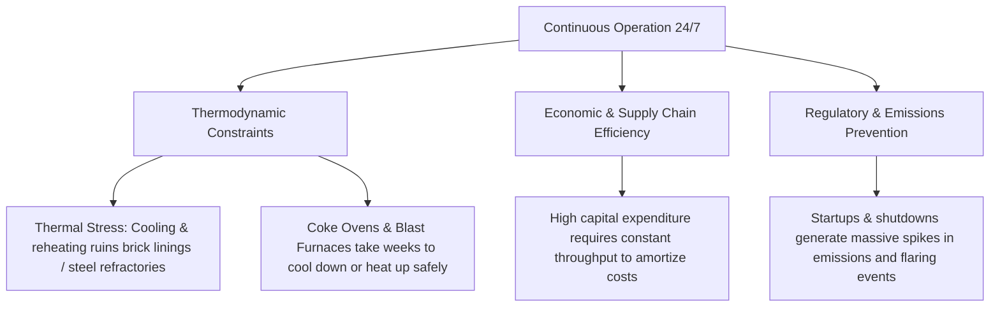

# Industrial Emitter Operating Hours Report: Louisville & Pittsburgh

This report compiles the operational schedules and working hours of the key chemical and industrial emitters in **Louisville (Rubbertown)** and **Pittsburgh (Mon Valley & Neville Island)**. The goal is to determine if weekly or daily fluctuations in odor complaints are caused by plants shutting down or reducing emissions on weekends.

---

## 🔍 Key Findings Summary

> [!IMPORTANT]
> **"Boulevard" vs. "Louisville":** Based on the workspace files and geographic complaint records (such as Dixie Highway, Algonquin Parkway, and Cane Run Road), the term **"Boulevard"** is confirmed to be a speech-to-text transcription typo for **"Louisville"** (specifically the Rubbertown industrial corridor).
> 
> **Operational Status:** All major chemical, petrochemical, and steel manufacturing plants in both Louisville and Pittsburgh operate **24 hours a day, 7 days a week (24/7)**. 

### What This Means for Our Odor Models:
* **Emissions are Continuous:** Because these facilities run 24/7, their baseline emissions do not stop on weekends.
* **Weekend Drop is Behavioral, Not Industrial:** The lower complaint volumes on weekends are not caused by plants shutting down. Instead, they are driven by **human activity bias** (e.g., changes in waking hours, weekend travel, or a higher threshold for filing reports when off work).
* **Validates Debiasing Models:** This finding strongly reinforces the necessity of the weekend/holiday controls and the diurnal sleep weighting implemented in our debiased analysis scripts ([Odor_Complaint_Analysis_v2_debiased.py](file:///Users/nawrig04/weather-varaible-analysis/Louisville%20Data/Odor_Complaint_Analysis_v2_debiased.py) and [Odor_Complaint_Analysis_v2_stats_debiased.py](file:///Users/nawrig04/weather-varaible-analysis/Louisville%20Data/Odor_Complaint_Analysis_v2_stats_debiased.py)).

---

## 📊 Comprehensive Directory of Industrial & Chemical Facilities

Below is a detailed breakdown of the major chemical, petrochemical, and heavy industrial facilities operating in both areas, compiled from local emissions records and online directories. All of these facilities run continuous baseline operations:

| Facility Name | Location / Area | Primary Products / Operations | Operating Hours | Operational Mode / Details |
| :--- | :--- | :--- | :--- | :--- |
| **American Synthetic Rubber Co. (ASRC / Michelin)** | Louisville (Rubbertown) | Synthetic rubber (polybutadiene) | **24/7/365** | Continuous polymerization reactors |
| **Dow Chemical / Rohm & Haas** | Louisville (Rubbertown) | Acrylic monomers and plastics | **24/7/365** | Continuous chemical synthesis lines |
| **Bakelite Synthetics (formerly Hexion)** | Louisville (Rubbertown) | Formaldehyde and phenolic resins | **24/7/365** | Continuous polymerization & batch runs |
| **The Chemours Company** | Louisville (Rubbertown) | Specialty fluorochemicals | **24/7/365** | Continuous gas and liquid reactors |
| **Lubrizol Advanced Materials** | Louisville (Rubbertown) | CPVC resins and compounds | **24/7/365** | Continuous polymer processing |
| **Zeon Chemicals LP** | Louisville (Rubbertown) | Nitrile rubber and elastomers | **24/7/365** | Continuous polymerization lines |
| **Carbide Industries** | Louisville (Rubbertown) | Calcium carbide and acetylene | **24/7/365** | Continuous electric arc furnaces |
| **Eckart America Corporation** | Louisville (Rubbertown) | Aluminum pigments and flakes | **24/7/365** | Continuous milling and sorting |
| **Altuglas International (Arkema Group)** | Louisville (Rubbertown) | Acrylic sheets and PMMA resins | **24/7/365** | Continuous sheet extrusion lines |
| **DuPont Specialty Products USA** | Louisville (Rubbertown) | Specialty chemical formulations | **24/7/365** | Continuous compounding & mixing |
| **Morris Forman Treatment Center (MSD)** | Louisville (Rubbertown) | Municipal wastewater treatment | **24/7/365** | Continuous sewage and sludge processing |
| **MPLX, Chevron, Valero, Buckeye Terminals** | Louisville (Rubbertown) | Bulk petroleum storage & blending | **24/7/365** | Fuel distribution and tanker loading |
| **JBS Swift Pork Processing Plant** | Louisville (Butchertown) | Meat processing & rendering | **24/7/365** | Continuous slaughterhouse & rendering operations (major organic/rancid odor) |
| **Outer Loop Landfill (Waste Management)** | Louisville (Okolona/Highview) | Municipal solid waste disposal | **24/7/365** | Continuous decomposition & gas capture (H2S/organic waste odors) |
| **Derek R. Guthrie Treatment Center (MSD)** | Louisville (Valley Station) | Municipal wastewater treatment | **24/7/365** | Continuous sewage treatment (H2S/sewer odors in South/Southwest) |
| **Clairton Coke Works (U.S. Steel)** | Pittsburgh (Mon Valley) | Coke and coal chemical byproducts | **24/7/365** | Continuous coking ovens (cannot cool) |
| **Edgar Thomson Plant (U.S. Steel)** | Pittsburgh (Braddock, PA) | Blast furnace steelmaking | **24/7/365** | Blast furnaces and continuous casting |
| **Irvin Plant (U.S. Steel)** | Pittsburgh (West Mifflin, PA) | Steel processing & hot rolling | **24/7/365** | Continuous sheet milling |
| **Neville Chemical Co. (Neville Island)** | Pittsburgh (Neville Island) | Hydrocarbon resins & plasticizers | **24/7/365** | Continuous polymerization (runs since 1927) |
| **Calgon Carbon Corp. (Neville Island)** | Pittsburgh (Neville Island) | Activated carbon manufacturing | **24/7/365** | Continuous baking & reactivation furnaces |
| **Ashland Inc. Neville Island Terminal** | Pittsburgh (Neville Island) | Bulk chemical shipping & logistics | **24/7/365** | Liquid transfer and barge loading |
| **National Polymers, Inc.** | Pittsburgh (Mon Valley / Speers) | Specialty polymers and compounding | **24/7/365** | Continuous compound extruders |
| **McConway & Torley Steel Foundry** | Pittsburgh (Lawrenceville) | Steel railroad coupler casting | **24/7/365** | Continuous shift foundry casting (metallic, resin, phenol/plastic odors) |
| **ALCOSAN Wastewater Plant** | Pittsburgh (North Side / Woods Run) | Municipal wastewater treatment | **24/7/365** | Continuous sewage treatment (H2S sewer and chlorine odors) |

> [!NOTE]
> *Historic Context:* The Shenango Inc. Coke Works on Neville Island was a major source of sulfur dioxide and odor complaints in Pittsburgh until its permanent closure in 2016.

---

## ⚙️ Why Do These Plants Run 24/7?

Heavy industrial and chemical plants run continuously due to fundamental thermodynamic, mechanical, and regulatory constraints:

1. **Thermodynamic Constraints (Thermal Shock):**
   * **Coke Ovens (Clairton):** Coking batteries operate at temperatures exceeding $1,800^\circ\text{F}$ to $2,000^\circ\text{F}$. Cooling the brick refractories causes contraction, cracking, and permanent structural damage. Shutting down coke ovens is a rare, multi-million-dollar event.
   * **Blast Furnaces (Edgar Thomson):** A blast furnace must be fed raw materials continuously. If it cools, the molten metal solidifies, effectively destroying the furnace.
2. **Regulatory & Emissions Impact:**
   * Transitioning a chemical plant from shut-down to startup is when the most severe air pollution violations occur. Safety systems (like flares) are used to burn off unreacted gases during startup. Continuous operation is actually required to keep emissions stable and within permit limits.
3. **Economic and Capital Efficiency:**
   * Synthetic rubber polymerization and monomer synthesis are continuous flow reactions. Stopping the reaction line results in wasted chemical batches, clogged piping, and expensive purging procedures.

---

## 📈 Impact on Odor Complaint Data

Because the physical emission sources are constant, the variations in our datasets must be explained by other factors:

### 1. Meteorological Drivers (The "Trap" Effect)
The model's meteorological predictors are the primary drivers of odor event days. Weather variables change diurnal dispersion:
* **Temperature Inversions (Boundary Layer Height):** Overnight, the boundary layer collapses, trapping continuous emissions close to the ground. This leads to high concentrations of odors that are noticed at dawn.
* **Wind Direction (SSE in Pittsburgh, SSW/W in Louisville):** Odor complaints spike when the wind blows directly from Clairton (SSE) or Rubbertown (SSW/W) toward high-density residential zip codes (e.g., Squirrel Hill 15217 in Pittsburgh, or Shively 40216 in Louisville).

### 2. Human Exposure & Reporting Bias (The "Observer" Effect)
The perceived "weekend effect" (fewer reports on Saturdays and Sundays) is a behavioral artifact:
* **Altered Schedules:** People wake up later, spend time away from their residential neighborhoods, or are engaged in leisure activities that distract from reporting.
* **Night-Shift and Sleep Cycles:** People filing reports are asleep overnight (typically 11:00 PM – 6:00 AM), which creates a false drop in complaints during hours when atmospheric inversions are strongest.
* **The Monday Morning Effect:** A minor spike is sometimes observed on Monday mornings when residents step outside for their commutes and notice the accumulated weekend pollution.

### 3. Non-Routine Industrial Events (The "Spikes")
While baseline emissions are continuous, the extreme outlier days (high complaint days not explained by weather) are typically caused by:
* **Equipment Malfunctions & Upset Events:** Sudden compressor failures, pipeline leaks, or emergency pressure relief flaring.
* **Weather-Triggered Accidents:** Power outages from local storms causing emission control systems to fail temporarily.

---

## ⏱️ Specific Times and Causes of Emission Spikes

While these facilities run 24/7, emissions are **not** perfectly uniform. There are specific operational cycles and events when emissions are significantly higher:

### 1. Process Cycling and Batch Operations
* **Coke Oven Charging & Pushing (Pittsburgh):** Coke production at Clairton works is done in batches across hundreds of individual ovens. When coal is "charged" (loaded) into an oven or the finished hot coke is "pushed" out, the oven is briefly opened to the atmosphere. Although the plant is continuous, these discrete charging and pushing steps generate short-term spikes in fugitive gases, sulfur compounds, and particulate matter.
* **Batch Reactor Cleaning and Purging (Louisville):** Many Rubbertown specialty chemical facilities (e.g., producing resins or polymers) utilize batch reactor systems rather than continuous flow lines. Reactor venting, line purging, and kettle cleaning cycles at the end of a batch run represent the highest periods of volatile organic compound (VOC) emissions.

### 2. Plant Startups and Shutdowns (SSM)
* Transitions between operations (e.g., shutting down a reactor for planned maintenance or restarting it) are historically the most pollutive times. Safety control equipment (like catalytic oxidizers or carbon adsorbers) requires optimal temperatures and flows to function. During startups and shutdowns, these controls are less efficient, resulting in significant emission spikes.

### 3. Planned Maintenance Windows
* **Weekday Daytime Maintenance:** Planned equipment cleaning, vessel venting, or safety testing typically occurs during weekday day shifts (Monday–Friday, 7:00 AM – 3:00 PM) when complete engineering and contracting crews are onsite. 

### 4. Emergency Upset Events
* **Equipment Malfunctions:** Sudden compression failures, pipe leaks, or power outages trigger emergency pressure-relief systems, routing large volumes of raw gases directly to safety flares. These unpredictable upset events are responsible for the largest single-day odor spikes in the data.

> [!TIP]
> **Important Distinction: Emissions vs. Perception**  
> While the above cycles cause minor variations in actual emissions, **meteorology** is what creates the massive diurnal spikes in *perceived* emissions. Because overnight temperature inversions trap gases close to the ground, odors accumulate overnight and peak at ground level between **4:00 AM and 8:00 AM**, creating the illusion of nighttime "chemical dumping" by facilities, even when emission rates remain constant.

---

## 🛠️ Recommendations for Future Modeling

To advance the odor complaint models, we should incorporate these findings as follows:
1. **Diurnal Activity Offset:** Implement a diurnal activity curve in the Poisson models to adjust for sleep/wake cycles.
2. **Emission Proxy Integration:** Use real-time EPA monitor data (like daily PM2.5 or SO₂ averages) as a proxy for actual emissions, rather than assuming emissions are perfectly constant.
3. **Upset Event Flags:** Obtain local health department records of industrial malfunctions to add as binary indicators for high-complaint outlier days.
